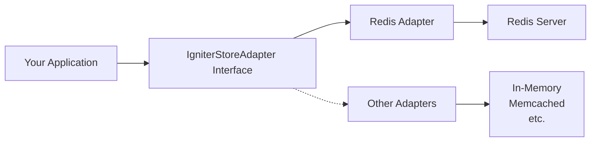

# Introduction

> High-performance caching and Pub/Sub messaging with Redis. Store provides a unified interface for key-value caching, atomic operations, and event-driven communication.
> URL: https://igniterjs.com/docs/store

## Overview

The Store adapter provides a powerful, type-safe interface for caching and Pub/Sub messaging in Igniter.js applications. Built on Redis, it enables high-performance data storage, retrieval, and real-time event broadcasting across your application. Whether you need to cache expensive database queries, manage user sessions, or build real-time features, the Store adapter gives you the tools to optimize performance and enable event-driven architectures.

The Store adapter abstracts away the complexity of Redis operations, providing a clean, intuitive API that handles serialization, connection management, and error handling automatically. This makes it easy to add caching and real-time features to your application without worrying about the underlying implementation details.

<Callout type="info">
  The Store adapter enables both caching capabilities and real-time features via Pub/Sub messaging. Adding a store adapter also automatically enables the `.realtime` service for building real-time applications.
</Callout>

### Key Features

- **Key-Value Caching**: Store and retrieve data with automatic JSON serialization
- **TTL Support**: Set expiration times on cached values to keep data fresh
- **Pub/Sub Messaging**: Publish and subscribe to channels for event-driven communication
- **Atomic Operations**: Increment counters and manage key expiration atomically
- **Type Safety**: Full TypeScript inference from store operations to cached values
- **Adapter Architecture**: Works with any Redis-compatible backend via the adapter pattern

---

## Architecture

The Store system follows Igniter.js's adapter pattern, providing a unified interface (`IgniterStoreAdapter`) that can be implemented by different storage backends. The Redis adapter (`@igniter-js/adapter-redis`) is the production-ready implementation, but you can create custom adapters for in-memory storage, Memcached, or any other storage backend that fits your needs.

This architecture provides flexibility—you can swap storage backends without changing your application code. The adapter handles all the low-level details like serialization, connection management, and error handling, so you can focus on building features rather than managing infrastructure.



The adapter handles:

- **Serialization**: Automatic JSON stringify/parse for complex objects
- **Client Management**: Separate clients for commands and subscriptions (Redis requirement)
- **Error Handling**: Graceful fallbacks and error recovery

---

## Quick Start

Get started with the Store adapter in minutes. This quick start guide shows you how to install dependencies, create the adapter, register it with Igniter, and start using it in your actions. Follow these steps to add high-performance caching and Pub/Sub messaging to your application.

<Card title="Quick Start Guide">
  <Steps>
    <Step>
      ### Install Dependencies

      Install the Redis adapter and its peer dependency:

      <Tabs items={['npm', 'pnpm', 'yarn', 'bun']} groupId="package-manager">
        <Tab value="npm">
          ```bash
          npm install @igniter-js/adapter-redis ioredis
          ```
        </Tab>

        <Tab value="pnpm">
          ```bash
          pnpm add @igniter-js/adapter-redis ioredis
          ```
        </Tab>

        <Tab value="yarn">
          ```bash
          yarn add @igniter-js/adapter-redis ioredis
          ```
        </Tab>

        <Tab value="bun">
          ```bash
          bun add @igniter-js/adapter-redis ioredis
          ```
        </Tab>
      </Tabs>
    </Step>

    <Step>
      ### Create the Adapter

      Create a Redis client and wrap it with the Store adapter:

      ```typescript
      // src/services/store.ts
      import { createRedisStoreAdapter } from '@igniter-js/adapter-redis';
      import { Redis } from 'ioredis';

      const redis = new Redis(process.env.REDIS_URL);

      export const store = createRedisStoreAdapter(redis);
      ```
    </Step>

    <Step>
      ### Register with Igniter

      Register the store adapter in your main Igniter configuration:

      ```typescript
      // src/igniter.ts
      import { Igniter } from '@igniter-js/core';
      import { createIgniterAppContext } from '@/igniter.context';
      import { store } from './services/store';

      export const igniter = Igniter
        .context(createIgniterAppContext())
        .store(store)
        .create();
      ```
    </Step>

    <Step>
      ### Use in Your Actions

      Use `igniter.store` to access the store service in your handlers:

      ```typescript
      export const usersController = igniter.controller({
        name: 'Users',
        description: 'Manage user accounts and data',
        path: '/users',
        actions: {
          list: igniter.query({
            name: 'List Users',
            description: 'Retrieve a list of all users with caching',
            path: '/',
            handler: async ({ context, response }) => {
              // Check cache first
              const cached = await igniter.store.get<User[]>('users:list');

              if (cached) {
                return response.success({ users: cached, source: 'cache' });
              }

              // Fetch from database
              const users = await context.db.users.findMany();

              // Cache for 5 minutes
              await igniter.store.set('users:list', users, { ttl: 300 });

              return response.success({ users, source: 'database' });
            },
          }),
        },
      });
      ```
    </Step>

  </Steps>
</Card>

---

## Core Concepts

The Store adapter provides three main capabilities that work together to enable high-performance applications. Understanding these concepts helps you use the Store effectively in your application, whether you're caching data, building real-time features, or managing distributed state.

<Accordions>
  <Accordion title="Caching">
    Use the store for high-performance caching of expensive operations. Caching stores frequently accessed data in Redis, dramatically improving response times and reducing load on your database or external APIs. The Store adapter automatically handles JSON serialization, so you can cache complex objects without manual conversion.

    **Key Methods:**

    * **`get<T>(key)`**: Retrieve cached values with automatic deserialization
    * **`set(key, value, options?)`**: Store values with optional TTL
    * **`delete(key)`**: Remove cached entries
    * **`has(key)`**: Check if a key exists without retrieving its value

    Caching is perfect for API responses, database query results, computed values, and any data that's expensive to generate but doesn't change frequently.

  </Accordion>

  <Accordion title="Pub/Sub Messaging">
    Enable event-driven communication between services using Pub/Sub messaging. Pub/Sub allows different parts of your application to communicate asynchronously without tight coupling. Publishers send messages to channels, and subscribers receive them automatically.

    **Key Methods:**

    * **`publish(channel, message)`**: Broadcast messages to subscribers
    * **`subscribe(channel, callback)`**: Listen for messages on a channel
    * **`unsubscribe(channel, callback?)`**: Stop listening to channels

    Pub/Sub is ideal for real-time notifications, event broadcasting, microservices communication, and decoupled architectures. Messages are automatically serialized as JSON, making it easy to send complex data structures.

  </Accordion>

  <Accordion title="Atomic Operations">
    Perform atomic operations on numeric values and manage key expiration. Atomic operations are guaranteed to execute without interference from concurrent operations, making them perfect for counters, rate limiting, and expiration management in distributed systems.

    **Key Methods:**

    * **`increment(key)`**: Atomically increment a counter
    * **`expire(key, ttl)`**: Set or update a key's expiration time

    Atomic operations are essential for building reliable distributed systems where multiple processes might modify the same key simultaneously. They ensure data consistency without locks.

  </Accordion>
</Accordions>

---

## Use Cases

The Store adapter enables many powerful use cases in modern applications. Here are some common patterns that demonstrate how you can use caching, Pub/Sub messaging, and atomic operations to build high-performance, scalable applications.

<Accordions>
  <Accordion title="API Response Caching">
    Cache expensive database queries or external API calls to improve response times and reduce load on your infrastructure. This pattern checks the cache first, returning cached data if available, and only fetching from the source when necessary.

    ```typescript
    const cached = await igniter.store.get<ApiResponse>('api:data');
    if (cached) return cached;

    const data = await fetchExpensiveData();
    await igniter.store.set('api:data', data, { ttl: 3600 });
    return data;
    ```

    API response caching is perfect for data that doesn't change frequently but is expensive to compute or fetch. Set appropriate TTL values based on how often your data updates.

  </Accordion>

  <Accordion title="Session Management">
    Store user sessions with automatic expiration. Sessions are temporary data that need to persist across requests but should expire after a period of inactivity. The Store adapter makes it easy to manage session lifecycle with TTL.

    ```typescript
    await igniter.store.set(`session:${userId}`, sessionData, { ttl: 86400 });
    ```

    Session management is essential for user authentication and state management. The automatic expiration ensures sessions don't persist indefinitely, improving security and memory usage.

  </Accordion>

  <Accordion title="Real-Time Notifications">
    Broadcast events across your application using Pub/Sub messaging. Real-time notifications keep users informed about important events without requiring them to poll for updates. Multiple subscribers can listen to the same channel, enabling scalable notification systems.

    ```typescript
    // Publisher
    await igniter.store.publish('notifications', {
      userId: '123',
      message: 'You have a new message',
    });

    // Subscriber
    await igniter.store.subscribe('notifications', async (message) => {
      console.log('Notification received:', message);
    });
    ```

    Real-time notifications improve user experience by providing instant feedback. They're perfect for chat applications, activity feeds, and event-driven architectures.

  </Accordion>

  <Accordion title="Rate Limiting">
    Use atomic increments for rate limiting to prevent abuse and protect your API from being overwhelmed. Atomic operations ensure accurate counting even when multiple requests arrive simultaneously, making them ideal for distributed rate limiting.

    ```typescript
    const count = await igniter.store.increment(`rate:${userId}`);
    if (count === 1) {
      await igniter.store.expire(`rate:${userId}`, 60);
    }
    if (count > 100) {
      throw new Error('Rate limit exceeded');
    }
    ```

    Rate limiting protects your application from abuse while ensuring legitimate users can still access your services. Combine atomic increments with expiration to implement time-window-based rate limiting.

  </Accordion>
</Accordions>

---
