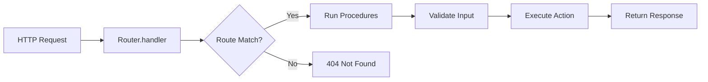

# Router

> Learn how to create and configure routers to assemble your API with full type safety, server-side calling, and HTTP handling.
> URL: https://igniterjs.com/docs/core/router

## Overview

The **Router** is the central entrypoint for all HTTP requests in your Igniter.js application. It maps incoming requests to your controllers and actions, providing both HTTP handling and type-safe server-side invocation.

```typescript
import { igniter } from "@/igniter";
import { userController } from "@/features/users/user.controller";
import { postController } from "@/features/posts/post.controller";

export const AppRouter = igniter.router({
  controllers: {
    users: userController,
    posts: postController,
  },
});
```

<Callout type="info" title="What is a Router?">
  A Router connects your **controllers** (grouped actions) to HTTP endpoints and provides a **type-safe caller** for server-side invocation without HTTP overhead.
</Callout>

---

## Creating a Router

### Basic Router

The simplest way to create a router is with the `igniter.router()` method:

```typescript
import { igniter } from "@/igniter";
import { userController } from "./features/users/user.controller";

export const AppRouter = igniter.router({
  controllers: {
    users: userController,
  },
});
```

This creates a router with:

- ✅ **HTTP handler** at `AppRouter.handler(request)`
- ✅ **Type-safe caller** at `AppRouter.caller.users.actionName()`
- ✅ **Full type inference** for all endpoints

### Multiple Controllers

Group related features into separate controllers:

```typescript
import { igniter } from "@/igniter";
import { userController } from "./features/users/user.controller";
import { postController } from "./features/posts/post.controller";
import { commentController } from "./features/comments/comment.controller";

export const AppRouter = igniter.router({
  controllers: {
    users: userController,
    posts: postController,
    comments: commentController,
  },
});
```

<Callout type="success">
  Each controller's `path` property is automatically prefixed to create full routes:

- `/users/*` for `userController`
- `/posts/*` for `postController`
- `/comments/*` for `commentController`
</Callout>

---

## Router Properties

### `.handler(request)`

The **HTTP request handler** that processes incoming requests and routes them to the appropriate action.

```typescript
export const AppRouter = igniter.router({
  controllers: { users: userController },
});

// Use in Next.js API route
export async function POST(request: Request) {
  return AppRouter.handler(request);
}

// Use in Express
app.all("/api/*", async (req, res) => {
  const request = convertToWebRequest(req);
  const response = await AppRouter.handler(request);
  return sendWebResponse(res, response);
});

// Use in Bun
Bun.serve({
  port: 3000,
  fetch: AppRouter.handler,
});
```

#### Request Processing Flow



---

### `.caller`

The **type-safe server-side caller** allows you to invoke actions directly without HTTP overhead. Perfect for:

- ✅ Server-side rendering (SSR)
- ✅ Server components
- ✅ Integration tests
- ✅ Internal microservice calls

```typescript
export const AppRouter = igniter.router({
  controllers: {
    users: userController,
    posts: postController,
  },
});

// Server-side usage
const user = await AppRouter.caller.users.getById.query({ id: "123" });
const post = await AppRouter.caller.posts.create.mutate({
  body: { title: "Hello", content: "World" },
});
```

<Callout type="info" title="No HTTP Overhead">
  The `.caller` bypasses the HTTP layer entirely, directly invoking your action handlers with full type safety. It's significantly faster than HTTP calls!
</Callout>

#### Caller API

The caller API matches your action types:

**For Query Actions:**

```typescript
// Query action (GET)
const result = await AppRouter.caller.users.list.query();
const user = await AppRouter.caller.users.getById.query({ id: "123" });
```

**For Mutation Actions:**

```typescript
// Mutation action (POST/PUT/DELETE/PATCH)
const created = await AppRouter.caller.users.create.mutate({
  body: { name: "John", email: "john@example.com" },
});

const updated = await AppRouter.caller.users.update.mutate({
  params: { id: "123" },
  body: { name: "Jane" },
});

const deleted = await AppRouter.caller.users.delete.mutate({
  params: { id: "123" },
});
```

#### Full Input Object

The caller accepts the same input structure as client calls:

```typescript
const result = await AppRouter.caller.users.search.query({
  query: { q: "john", limit: 10 }, // Query parameters
  headers: { "x-api-key": "secret" }, // Headers
  cookies: { sessionId: "abc123" }, // Cookies
  credentials: "include", // Credentials
});
```

---

### `.controllers`

Access to the registered controllers object:

```typescript
const AppRouter = igniter.router({
  controllers: {
    users: userController,
    posts: postController,
  },
});

console.log(AppRouter.controllers.users); // userController
console.log(AppRouter.controllers.posts); // postController
```

---

### `.config`

The router configuration including `baseURL` and `basePATH`:

```typescript
const AppRouter = igniter.router({
  controllers: { users: userController },
});

console.log(AppRouter.config.baseURL); // From Igniter config
console.log(AppRouter.config.basePATH); // From Igniter config
```

---

## Framework Integration

### Next.js App Router

Create an API route that catches all requests:

<Files>
  <Folder name="src" defaultOpen>
    <Folder name="app" defaultOpen>
      <Folder name="api" defaultOpen>
        <Folder name="v1" defaultOpen>
          <Folder name="[...path]" defaultOpen>
            <File name="route.ts" />
          </Folder>
        </Folder>
      </Folder>
    </Folder>

    <File name="igniter.router.ts" />

  </Folder>
</Files>

```typescript
// src/app/api/v1/[...path]/route.ts
import { AppRouter } from "@/igniter.router";

export async function GET(request: Request) {
  return AppRouter.handler(request);
}

export async function POST(request: Request) {
  return AppRouter.handler(request);
}

export async function PUT(request: Request) {
  return AppRouter.handler(request);
}

export async function DELETE(request: Request) {
  return AppRouter.handler(request);
}

export async function PATCH(request: Request) {
  return AppRouter.handler(request);
}
```

<Callout type="success">
  All HTTP methods route through `.handler()`, which automatically dispatches to the correct action based on path and method.
</Callout>

---

### Next.js Pages Router

```typescript
// pages/api/v1/[...path].ts
import type { NextApiRequest, NextApiResponse } from "next";
import { AppRouter } from "@/igniter.router";

export default async function handler(
  req: NextApiRequest,
  res: NextApiResponse
) {
  // Convert Next.js request to Web Request
  const request = new Request(`http://localhost:3000${req.url}`, {
    method: req.method,
    headers: req.headers as HeadersInit,
    body: req.method !== "GET" ? JSON.stringify(req.body) : undefined,
  });

  const response = await AppRouter.handler(request);

  // Convert Web Response to Next.js response
  const data = await response.json();
  res.status(response.status).json(data);
}
```

---

### Express

```typescript
import express from "express";
import { AppRouter } from "./igniter.router";

const app = express();

app.use(express.json());

// Catch-all route
app.all("/api/v1/*", async (req, res) => {
  try {
    const request = new Request(`http://localhost:${port}${req.url}`, {
      method: req.method,
      headers: req.headers as HeadersInit,
      body: ["GET", "HEAD"].includes(req.method)
        ? undefined
        : JSON.stringify(req.body),
    });

    const response = await AppRouter.handler(request);
    const data = await response.json();

    res.status(response.status).json(data);
  } catch (error) {
    res.status(500).json({ error: "Internal Server Error" });
  }
});

app.listen(3000);
```

---

### Bun

```typescript
// server.ts
import { AppRouter } from "./igniter.router";

Bun.serve({
  port: 3000,
  fetch: AppRouter.handler,
});

console.log("Server running at http://localhost:3000");
```

<Callout type="success" title="Native Web APIs">
  Bun supports Web APIs natively, so you can use `AppRouter.handler` directly as the `fetch` handler!
</Callout>

---

### TanStack Start

```typescript
// app/routes/api.v1.$.ts
import { AppRouter } from "@/igniter.router";

export async function loader({ request }: { request: Request }) {
  return AppRouter.handler(request);
}

export async function action({ request }: { request: Request }) {
  return AppRouter.handler(request);
}
```

---

## Server-Side Usage

### React Server Components (Next.js)

```typescript
// app/users/page.tsx
import { AppRouter } from "@/igniter.router";

export default async function UsersPage() {
  // Direct server-side call - no HTTP!
  const { data } = await AppRouter.caller.users.list.query();

  return (
    <div>
      <h1>Users</h1>
      <ul>
        {data.users.map((user) => (
          <li key={user.id}>{user.name}</li>
        ))}
      </ul>
    </div>
  );
}
```

### Server Actions (Next.js)

```typescript
"use server";

import { AppRouter } from "@/igniter.router";

export async function createUser(formData: FormData) {
  const name = formData.get("name") as string;
  const email = formData.get("email") as string;

  const result = await AppRouter.caller.users.create.mutate({
    body: { name, email },
  });

  return result;
}
```

### API Routes

```typescript
// app/api/internal/sync-users/route.ts
import { AppRouter } from "@/igniter.router";

export async function POST() {
  // Use caller for internal API routes
  const users = await AppRouter.caller.users.list.query();

  // Process users...

  return Response.json({ success: true });
}
```

---

## Testing with Caller

The `.caller` is perfect for integration tests:

```typescript
import { describe, it, expect } from "vitest";
import { AppRouter } from "@/igniter.router";

describe("User API", () => {
  it("should create a user", async () => {
    const result = await AppRouter.caller.users.create.mutate({
      body: {
        name: "Test User",
        email: "test@example.com",
      },
    });

    expect(result.data.user).toMatchObject({
      name: "Test User",
      email: "test@example.com",
    });
  });

  it("should list all users", async () => {
    const result = await AppRouter.caller.users.list.query();

    expect(result.data.users).toBeInstanceOf(Array);
  });

  it("should get user by ID", async () => {
    // Create user first
    const created = await AppRouter.caller.users.create.mutate({
      body: { name: "John", email: "john@example.com" },
    });

    // Get by ID
    const result = await AppRouter.caller.users.getById.query({
      id: created.data.user.id,
    });

    expect(result.data.user.name).toBe("John");
  });

  it("should handle not found", async () => {
    await expect(
      AppRouter.caller.users.getById.query({ id: "non-existent" })
    ).rejects.toThrow();
  });
});
```

<Callout type="success" title="Fast Tests">
  Using `.caller` for tests is **much faster** than making HTTP requests. It directly invokes handlers with full type safety!
</Callout>

---

## Type Inference

The router provides complete type inference for both HTTP and caller usage:

```typescript
const AppRouter = igniter.router({
  controllers: {
    users: userController,
    posts: postController,
  },
});

// ✅ Fully typed
type RouterType = typeof AppRouter;

// ✅ Extract caller type
type Caller = RouterType["caller"];

// ✅ Extract specific action
type UsersList = Caller["users"]["list"];

// ✅ Use in functions
async function getUsers(): Promise<ReturnType<UsersList["query"]>> {
  return AppRouter.caller.users.list.query();
}
```

### Infer Context Type

```typescript
type AppContext = typeof AppRouter.$Infer.$context;
// Result: The context type defined in Igniter.context<T>()
```

### Infer Plugins Type

```typescript
type AppPlugins = typeof AppRouter.$Infer.$plugins;
// Result: The plugins type defined in Igniter.plugins<T>()
```

---

## Advanced Patterns

### Multiple Routers

You can create multiple routers for different API versions or domains:

```typescript
// v1 router
export const AppRouterV1 = igniter.router({
  controllers: {
    users: userControllerV1,
    posts: postControllerV1,
  },
});

// v2 router
export const AppRouterV2 = igniter.router({
  controllers: {
    users: userControllerV2,
    posts: postControllerV2,
    analytics: analyticsController, // New in v2
  },
});
```

```typescript
// app/api/v1/[...path]/route.ts
export async function GET(request: Request) {
  return AppRouterV1.handler(request);
}

// app/api/v2/[...path]/route.ts
export async function GET(request: Request) {
  return AppRouterV2.handler(request);
}
```

### Router Composition

Create domain-specific routers and compose them:

```typescript
// Public API router
export const PublicRouter = igniter.router({
  controllers: {
    auth: authController,
    products: productsController,
  },
});

// Admin API router
export const AdminRouter = igniter.router({
  controllers: {
    users: adminUsersController,
    analytics: analyticsController,
    settings: settingsController,
  },
});
```

---

## Best Practices

### 1. Single Export

Export your router from a central file:

```typescript
// src/igniter.router.ts
import { igniter } from "@/igniter";
import { userController } from "@/features/users/user.controller";
import { postController } from "@/features/posts/post.controller";

export const AppRouter = igniter.router({
  controllers: {
    users: userController,
    posts: postController,
  },
});

export type AppRouterType = typeof AppRouter;
```

### 2. Use Caller for Server-Side

Always prefer `.caller` over HTTP requests when calling from the server:

```typescript
// ❌ Bad - HTTP overhead on same server
const response = await fetch("http://localhost:3000/api/v1/users");
const data = await response.json();

// ✅ Good - Direct invocation, faster and type-safe
const { data } = await AppRouter.caller.users.list.query();
```

### 3. Group Related Controllers

Organize controllers by feature or domain:

```typescript
export const AppRouter = igniter.router({
  controllers: {
    // User management
    users: userController,
    profiles: profileController,

    // Content
    posts: postController,
    comments: commentController,

    // Admin
    analytics: analyticsController,
    settings: settingsController,
  },
});
```

### 4. Type-Safe Error Handling

```typescript
try {
  const result = await AppRouter.caller.users.getById.query({ id: "123" });
  console.log(result.data.user);
} catch (error) {
  // Errors are automatically thrown from .caller
  console.error("User not found:", error);
}
```

---

## Debugging

### Enable Request Logging

The router automatically logs requests when in development mode. You can also access logs programmatically:

```typescript
const response = await AppRouter.handler(request);

// Logs include:
// - Incoming request (URL, method, headers)
// - Parsed request (path, basePath, queryParams)
// - Routing decision (controller, action)
// - Response (status, headers, body)
```

### Inspect Router Structure

```typescript
console.log(AppRouter.controllers); // All controllers
console.log(AppRouter.config); // Router config
console.log(AppRouter.caller); // Caller proxy
```

---

## Next Steps

Now that you understand routers, dive deeper into the building blocks:

<Cards>
  <Card title="Controllers" href="/docs/controllers">
    Learn how to group actions into controllers
  </Card>

  <Card title="Actions" href="/docs/actions">
    Create queries and mutations for your endpoints
  </Card>

  <Card title="Context" href="/docs/context">
    Understand static vs dynamic context patterns
  </Card>

  <Card title="Client" href="/docs/client">
    Use the type-safe client in your frontend
  </Card>
</Cards>
